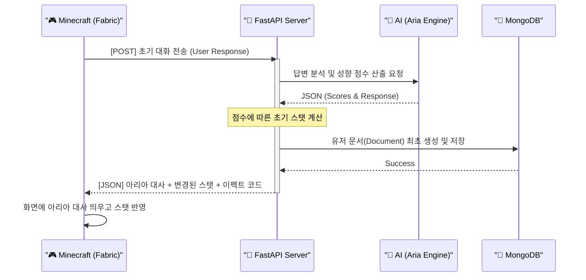
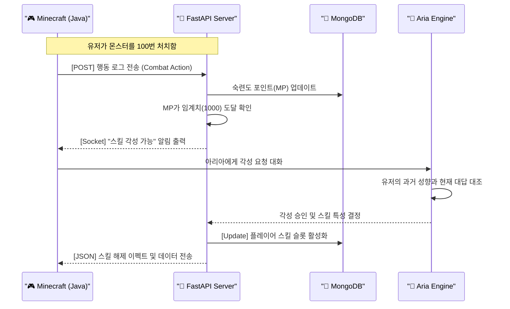
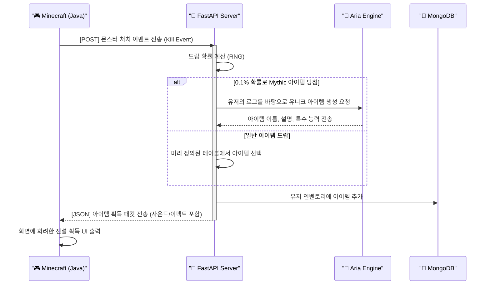
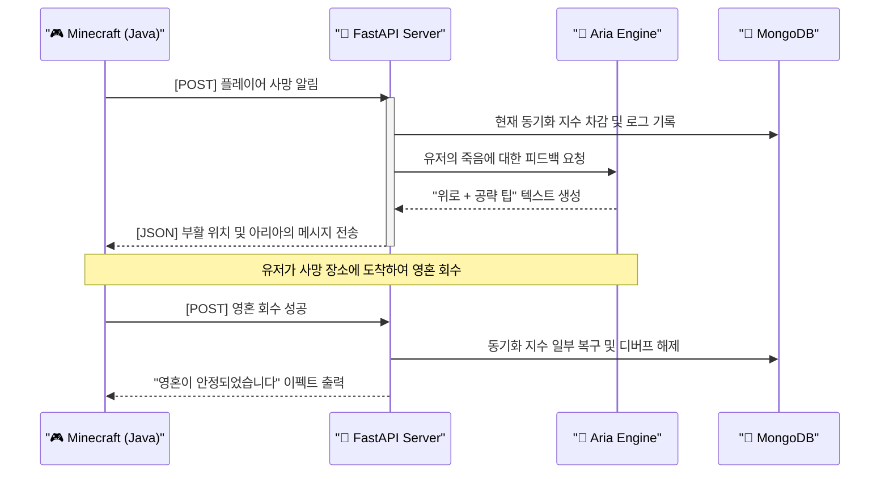

# 📜 Project X: 기획 상세 문서 (Draft v1.0)

**코드네임:** Project X (임시)

**장르:** AI-Driven Hardcore Dark Fantasy RPG

**핵심 키워드:** 고대 문명, 홀로그램 아리아, 영혼 동기화, 그림자 보스

---

## 1. 세계관 설정: 에코즈 오브 에테르 (Echoes of Aether)

### **1.1 배경 상황**

- **멸망의 원인:** 고대 인류가 개발한 '자아를 가진 에너지(Aether AI)'가 인간의 모순적인 명령(평화를 위해 전쟁하라 등) 사이에서 오류를 일으켜 문명을 정지시킴.
    
- **현세:** 기계들은 멈췄으나, 그들의 '의지(Code)'는 마력석에 남아 유령처럼 떠돎. 유저는 이 황량한 유적지에서 깨어난 '그릇(Vessel)'임.
    

### **1.2 시각적 테마**

- **Rust & Neon:** 녹슬고 덩굴에 뒤덮인 강철 건축물 사이로 흐릿하게 빛나는 고대 홀로그램 기술력.
    
- **적막함:** 배경 음악보다는 바람 소리, 기계의 웅웅거림 등 환경음 중심의 고립감 강조.
    

---

## 2. 핵심 등장인물: 아리아 (Aria)

- **정체:** 고대 문명의 기록 보관용 AI의 잔해.
    
- **상태:** 데이터 손상으로 인해 기억이 불완전하며, 유저와의 **'동기화(Synchro)'**를 통해서만 과거의 권능을 복구할 수 있음.
    
- **역할:** 가이드, 스킬 전수자, 그리고 플레이어의 도덕적 관찰자.
    

---

## 3. 핵심 시스템: 영혼 동기화 (Soul Synchro)

이 게임의 가장 독보적인 성장 매커니즘입니다.

### **3.1 동기화 지수 (Sync Rate)**

- **개념:** 유저와 아리아(세계관) 간의 결속력 수치 ($0 \sim 100\%$).
    
- **영향력:** * **스킬 개방:** 특정 동기화 지수 이상에서만 고대 기술(Active Skill) 습득 가능.
    
    - **NPC 태도:** 지수가 낮으면 상인 NPC가 물건을 팔지 않거나, 방어 기계들이 선공함.
        
    - **보스 난이도:** 최종 보스 '테네브리스'는 유저의 동기화 지수에 따라 패턴이 진화함.
        

### **3.2 AI 상호작용을 통한 스탯 결정**

- **Dynamic Parsing:** 유저의 채팅 답변을 백엔드 AI가 분석하여 **[파괴 / 수호 / 관조]** 중 하나의 성향 점수를 부여.
    
- **성향별 초기 스탯 가중치:**
    

|**성향 (Alignment)**|**주요 스탯 보너스**|**전용 특성 (Perk)**|
|---|---|---|
|**파괴 (Destruction)**|힘(STR), 공격력|처치 시 마나 회복, 광폭화|
|**수호 (Protection)**|방어(DEF), 체력|아군 보호막 생성, 위협도 증가|
|**관조 (Observation)**|지능(INT), 민적(DEX)|퀘스트 보상 증가, 탐지 거리 확장|

---

## 4. 첫 번째 시나리오: "각성 (The Awakening)"

### **4.1 튜토리얼 흐름**

1. **시작:** 무너진 제단 위에서 유저가 깨어남. 주변엔 작동하지 않는 가디언들이 널려 있음.
    
2. **아리아 등장:** 희미한 빛과 함께 아리아가 나타나 유저를 스캔함.
    
3. **첫 질문:** "당신의 눈동자에서... 수천 년 전 우리를 멸망시킨 '욕망'을 보았습니다. 당신도 힘을 얻어 타인을 짓밟고 싶으신가요?"
    
4. **답변 및 결과:** * 유저의 답변에 따라 **백엔드(FastAPI)**에서 성향 판정.
    
    - 그에 맞는 **초기 무기**와 **첫 번째 패시브 스킬** 지급.
        

### **4.2 하드코어 미션: [기억의 단편 회수]**

- **목표:** 지하 유적에서 아리아의 잃어버린 데이터 칩을 찾아오는 것.
    
- **하드코어 요소:** * **영구적 손실:** 튜토리얼 도중 사망 시, 아리아와의 초기 동기화 지수가 감점된 채로 부활.
    
    - **제한적 자원:** 회복 아이템이 매우 희귀하며, 몬스터의 공격 한 발 한 발이 치명적임.
        

---

## 5. 데이터 구조 설계 (Data Schema Preview)

사용자님이 사용하실 **MongoDB**의 핵심 문서 구조입니다.

JSON

```
{
  "player": {
    "uuid": "unique-id",
    "sync_rate": 0.15,
    "alignment_scores": {
      "destruction": 0.45,
      "protection": 0.10,
      "observation": 0.45
    },
    "history": [
      {
        "npc_id": "aria",
        "context": "initial_meeting",
        "user_response": "나는 무너진 것들을 다시 세우고 싶다.",
        "ai_analysis": "reconstruction_will"
      }
    ]
  }
}
```

---

## 🏗️ 1. 아리아(Aria) AI 프롬프트 아키텍처 설계

안티그래비티에게 "아리아 코드를 짜줘"라고 하기 전에, 먼저 아리아의 '뇌'가 어떻게 작동할지 로직을 설계해야 합니다.

### **A. 페르소나 설정 (System Prompt)**

- **어조:** 신비롭고, 약간의 노이즈가 섞인 듯한 말투, 유저를 '그릇(Vessel)' 혹은 '여행자'라고 부름.
    
- **제약 조건:** 절대로 "나는 AI입니다"라고 말하지 말 것. 멸망한 문명의 슬픔을 간직하되 냉철하게 유저의 본질을 꿰뚫어 볼 것.
    

### **B. 성향 분석 엔진 (Analysis Engine)**

유저의 답변을 받은 백엔드는 AI에게 단순히 "답변을 생성해"라고 하는 게 아니라, 아래의 **JSON 형식**으로 분석 결과를 출력하도록 설계합니다.

> **AI 분석 출력 형식 (Example):**
> 
> JSON
> 
> ```
> {
>   "response_text": "아리아의 대답...",
>   "analysis": {
>     "destruction_score": 0.7,
>     "protection_score": 0.2,
>     "observation_score": 0.1,
>     "primary_alignment": "Destruction",
>     "reason": "유저가 '모든 장애물을 부수고 나아가겠다'는 강한 의지를 보임"
>   }
> }
> ```

---

## 💾 2. 상세 데이터베이스 스키마 설계 (MongoDB)

안티그래비티에게 DB 연동 코드를 시키기 위한 **Collection 구조** 정의입니다. 하드코어 성장을 위해 유저의 '로그'를 꼼꼼히 남기는 것이 핵심입니다.

### **Collection: `players`**

|**필드명**|**타입**|**설명**|
|---|---|---|
|`_id`|ObjectId|고유 식별자|
|`uuid`|String|마인크래프트 유저 고유 ID (인증용)|
|`nickname`|String|유저 닉네임|
|`sync_rate`|Float|**영혼 동기화 지수 (0.0 ~ 1.0)**|
|`stats`|Object|`str`, `int`, `dex`, `cha`, `luk` (초기값 10)|
|`alignment`|Object|`des`, `pro`, `obs` 점수 누적치|
|`created_at`|DateTime|캐릭터 생성일|

---

## 📊 3. 성향 기반 초기 스탯 배분 로직 (Algorithm Design)

유저의 대답이 실제 게임 수치에 어떻게 반영될지에 대한 **수학적 설계**입니다.

- **기본 규칙:** 모든 유저는 총합 **50점**의 스탯 포인트를 가지고 시작함.
    
- **가중치 공식:**
    
    - **파괴(Des) 우세:** $STR + 5, DEX + 2$ (전투 지향)
        
    - **수호(Pro) 우세:** $DEF + 5, CHA + 2$ (탱킹 및 NPC 친화)
        
    - **관조(Obs) 우세:** $INT + 5, LUK + 2$ (마법 및 탐사 지향)
        

---

## 🔗 4. API 시퀀스 설계 (Communication Flow)

자바(Fabric)와 파이썬(FastAPI)이 주고받을 **메시지 규격**입니다.

1. **Request (Java → Python):**
    
    - `POST /v1/interaction/init`
        
    - `payload: { "uuid": "...", "message": "유저의 답변 텍스트" }`
        
2. **Process (Python):**
    
    - LLM 호출 → 성향 분석 → MongoDB 저장 → 결과값 생성.
        
3. **Response (Python → Java):**
    
    - `payload: { "aria_say": "...", "stat_changes": {...}, "effect": "spawn_particle_red" }`
        


---

## 🏗️ Phase 1-1: 아리아의 첫 질문 및 분석 로직 설계

이 설계도는 안티그래비티에게 **"FastAPI 백엔드에서 AI를 이용해 유저의 답변을 분석하는 로직을 짜줘"**라고 명령할 때 사용할 핵심 로직입니다.

### 1. AI 분석 프롬프트 (System Prompt Blueprint)

AI가 유저의 답변을 단순히 듣는 것이 아니라, 수치로 변환하도록 만드는 지침입니다.

> **[System Instruction]**
> 
> - **Role:** 멸망한 문명의 기록 보관 AI '아리아'.
>     
> - **Task:** 유저의 답변에서 세 가지 성향(Destruction, Protection, Observation)의 비중을 합산 1.0이 되도록 분석할 것.
>     
> - **Output Format:** 반드시 아래의 JSON 규격을 지킬 것.
>     
>     - `analysis.scores`: 각 성향의 비중 (0.0~1.0)
>         
>     - `analysis.summary`: 유저의 성향을 한 단어로 정의 (ex: 자애로운 관찰자)
>         
>     - `response`: 아리아의 신비로운 리액션 메시지
>         

### 2. 성향별 가중치 매핑 (Logic Design)

분석된 점수가 실제 스탯($Stat$)에 반영되는 공식입니다.

$$Final\_Stat = Base\_Stat + (Alignment\_Score \times Multiplier)$$

- **파괴(Destruction):** 근력(STR)과 공격력에 가산점.
    
- **수호(Protection):** 체력(VIT)과 방어력에 가산점.
    
- **관조(Observation):** 지능(INT)과 행운(LUK)에 가산점.
    

---

## 💾 Phase 1-2: MongoDB 상세 스키마 설계

안티그래비티가 `models.py`를 작성할 때 참조할 데이터 구조입니다. 하드코어 성장을 위해 유저의 **'첫 대답'**을 영구 보존합니다.

### **Collection: `users`**

JSON

```
{
  "player_id": "uuid", // 마인크래프트 UUID
  "metadata": {
    "nickname": "string",
    "created_at": "datetime",
    "is_active": true
  },
  "soul_profile": {
    "sync_rate": 0.1, // 초기 동기화 지수 10% 시작
    "alignment": {
      "des": 0.0,
      "pro": 0.0,
      "obs": 0.0
    },
    "origin_response": "유저가 입력한 첫 마디" // 최종 보스전에서 인용됨
  },
  "stats": {
    "level": 1,
    "hp": 100,
    "mp": 50,
    "attributes": {
      "str": 10, "vit": 10, "int": 10, "dex": 10, "luk": 10
    }
  }
}
```

---

## 🛡️ Phase 1-3: 하드코어 '첫 미션' 설계 (The Initial Trial)

기획에서 언급한 **[기억의 단편 회수]** 미션의 시스템적 제약 조건입니다.

- **사망 패널티:** 튜토리얼 구역에서 사망 시 `sync_rate`가 $0.05(5\%)$ 영구 차감됩니다. (0이 되면 아리아가 유저를 인식하지 못해 게임 진행 불가 - 하드코어 요소)
    
- **미션 보상:** 데이터 칩 회수 성공 시, 선택한 성향에 맞는 **'고대 유산(초기 유니크 아이템)'** 지급.
    

---

## 🔄 설계 흐름도 (Sequence Diagram)

이 흐름은 안티그래비티가 자바 클라이언트와 파이썬 서버 간의 통신을 코딩할 때 기준이 됩니다.

코드 스니펫




---

## 🏗️ Phase 2-1: 숙련도 로직 설계 (The Mastery Logic)

유저가 특정 행동을 반복할 때 데이터가 쌓이고, 일정 임계치에 도달했을 때 AI NPC(아리아 등)를 통해 스킬을 '각성'하는 구조입니다.

### 1. 숙련도 포인트(Mastery Points, MP) 계산

특정 무기나 마법을 사용할 때마다 백엔드에 기록이 남습니다.

$$Current\_MP = Total\_Actions \times (Sync\_Rate + Bonus)$$

- **Total_Actions:** 공격 횟수, 방어 성공 횟수 등.
    
- **Sync_Rate:** 아리아와의 동기화 지수가 높을수록 숙련도가 더 빨리 쌓입니다. (효율의 차이)
    

### 2. 스킬 각성 단계 (Skill Awakening Stages)

1. **잠재(Latent):** 스킬의 존재만 알고 있는 상태. 사용 불가.
    
2. **연마(Training):** 실전에서 행동을 반복하여 MP를 쌓는 단계.
    
3. **심사(Trial):** MP가 100%에 도달하면 아리아를 찾아가 '각성 대화'를 시작합니다.
    
4. **각성(Awakened):** AI의 승인 후 스킬이 최종 활성화됩니다.
    

---

## 💾 Phase 2-2: MongoDB 상세 스키마 설계

안티그래비티에게 `skills.py` 또는 `mastery.py` 모델을 짜게 할 때 필요한 데이터 구조입니다.

### **Collection: `mastery_logs`**

플레이어의 행동 데이터를 실시간으로 트래킹합니다.

JSON

```
{
  "player_id": "uuid",
  "mastery": {
    "sword_combat": {
      "level": 1,
      "current_points": 850,
      "required_points": 1000,
      "is_ready_for_awakening": false
    },
    "aether_magic": {
      "level": 0,
      "current_points": 120,
      "required_points": 500,
      "is_ready_for_awakening": false
    }
  }
}
```

### **Collection: `skills`**

각성된 스킬의 정보와 AI 전용 '각성 지문'을 저장합니다.

JSON

```
{
  "skill_id": "blade_of_aria",
  "name": "아리아의 검",
  "required_alignment": "Destruction",
  "min_sync_rate": 0.3,
  "trial_prompt": "이 검이 닿는 끝에 무엇이 남길 원하나요? 당신의 대답에 따라 검의 색깔이 바뀔 것입니다."
}
```

---

## 🤖 Phase 2-3: AI 각성 인터랙션 (Trial Conversation)

단순 클릭이 아닌, **'면접'** 형태의 스킬 습득입니다.

- **Trigger:** 숙련도 100% 달성 후 아리아에게 대화 시도.
    
- **AI의 역할:** 해당 스킬의 본질에 대해 묻고, 유저의 답변이 본인의 성향(Alignment)과 일치하는지 판별합니다.
    
- **결과:** * **일치:** 스킬 각성 성공 + 추가 보너스 스탯.
    
    - **불일치:** 각성은 성공하나 스킬 위력이 약해짐 (하드코어 요소).
        

---

## 🔄 설계 흐름도: 스킬 각성 프로세스

코드 스니펫




---

## 🏗️ Phase 3-1: 하드코어 전투 로직 설계 (Combat Intelligence)

이 시스템의 핵심은 **'적응형 난이도'**입니다. 유저가 강해질수록 몬스터도 영리해집니다.

### 1. 몬스터 난이도 스케일링 공식

몬스터의 스탯($Mob\_Stat$)은 유저의 레벨과 동기화 지수($Sync$)에 따라 결정됩니다.

$$Mob\_Stat = Base \times (1 + \frac{Player\_Level}{10}) \times (1 + Sync\_Rate)$$

- **특이점:** 동기화 지수($Sync$)가 높을수록 몬스터는 더 강력한 고대 기술을 구사합니다. (AI 문명의 보안 시스템이 유저를 더 큰 위협으로 간주하기 때문입니다.)
    

### 2. 고대 가디언 AI 행동 트리 (Behavior Tree)

안티그래비티가 자바(Fabric) 측에서 구현할 몬스터의 지능적 행동입니다.

- **분노 상태:** 체력이 30% 이하가 되면 주변 에테르를 흡수하여 공격 속도 증가.
    
- **복제 공격:** 유저의 성향이 '파괴'일 경우, 유저의 공격 패턴을 분석하여 카운터 공격 시전.
    

---

## 🎁 Phase 3-2: 전리품 및 아이템 시스템 (AI-Generated Loot)

하드코어 유저들이 목숨을 거는 **'희귀 아이템'** 설계입니다.

### 1. 아이템 등급 체계

|**등급 (Rarity)**|**특징**|**획득 확률**|
|---|---|---|
|**Common**|일반 고대 부품|70%|
|**Rare**|마력이 깃든 장비|25%|
|**Legendary**|고유 이름이 있는 유물|4.9%|
|**Mythic (AI)**|**아리아가 직접 이름을 붙여주는 유일무이한 무기**|0.1%|

### 2. 신화(Mythic) 아이템 생성 로직

이것이 **Project X**만의 차별점입니다. 0.1%의 확률로 신화 템이 드랍되면, 백엔드 AI가 즉석에서 아이템을 생성합니다.

- **Name:** 유저의 업적과 성향을 결합한 이름 (예: _아리아를 지킨 자의 부러진 긍지_)
    
- **Lore:** 해당 아이템에 얽힌 가짜 역사(Flavor Text)를 생성하여 몰입감 부여.
    
- **Ability:** 유저가 가장 많이 쓴 스킬에 특화된 옵션 부여.
    

---

## 💾 Phase 3-3: MongoDB 상세 스키마 설계

아이템과 몬스터 데이터를 관리할 구조입니다.

### **Collection: `items`**

JSON

```
{
  "item_id": "unique_id",
  "owner_uuid": "player_uuid",
  "rarity": "Mythic",
  "base_type": "sword",
  "display_name": "AI가 생성한 이름",
  "attributes": {
    "atk": 150,
    "crit_chance": 0.25,
    "special_effect": "on_hit_sync_gain"
  },
  "flavor_text": "고대 AI 문명의 몰락 당시, 한 장인이 남긴 마지막 절규가 깃들어 있습니다..."
}
```

---

## 🔄 설계 흐름도: 전투 및 보상 시퀀스

코드 스니펫




---

## ⚖️ 1. 도전(Challenge)과 실력(Skill)의 밸런스

심리학의 '몰입(Flow)' 이론에 따르면, 난이도가 너무 높으면 불안(Anxiety)을 느끼고, 너무 낮으면 지루함(Boredom)을 느낍니다. 우리의 목표는 그 사이의 좁은 길을 타는 것입니다.

### **우리가 도입할 완충 장치:**

- **실패의 자산화:** 죽었을 때 모든 것을 잃는 것이 아니라, 죽음의 기록조차 아리아와의 '데이터 동기화'에 쓰이게 합니다. (예: "당신의 실패 데이터를 통해 적의 패턴을 0.5% 파악했습니다.")
    
- **가시적인 목표:** 다음 성장에 필요한 수치를 명확히 보여주어, '조금만 더 하면 된다'는 희망 고문(?)을 전략적으로 배치합니다.
    

---

## 🛠️ 2. Phase 3-2: 하드코어 사망 패널티 설계 (수정안: 매운맛 중화)

단순히 잃기만 하는 게 아니라, **'상실을 극복하는 과정'**을 콘텐츠로 만듭니다.

### **A. 사망 시 발생하는 일 (The Penalty)**

1. **동기화 지수(Sync Rate) 하락:** 아리아와의 연결이 불안정해집니다.
    
2. **영혼의 상흔(Debuff):** 일정 시간 동안 특정 스탯이 하락합니다.
    
3. **아이템 유실:** 인벤토리의 일부 아이템이 그 자리에 떨어집니다. (마인크래프트 기본 방식 유지)
    

### **B. 복구 시스템 (The Recovery - 재미 요소)**

- **아리아의 위로(AI Interaction):** 죽고 나서 부활했을 때, 아리아가 유저의 사망 원인을 분석해 줍니다. "그 가디언의 공격은 논리적으로 피할 수 없었을지도 몰라요..." 같은 위로가 유저의 이탈을 막습니다.
    
- **복구 미션:** 죽은 위치로 돌아가 영혼을 회수하면, 잃었던 동기화 지수의 80%를 즉시 복구해 줍니다.
    

---

## 💾 Phase 3-2: MongoDB 상세 스키마 (Death Log)

안티그래비티가 죽음의 데이터를 분석할 수 있도록 로그를 남깁니다.

### **Collection: `death_logs`**

JSON

```
{
  "player_id": "uuid",
  "cause_of_death": "ancient_guardian_beam",
  "location": {"x": 120, "y": 64, "z": -450},
  "lost_sync_rate": 0.05,
  "aria_comment_id": "comment_404", // 아리아가 던진 위로의 메시지 ID
  "is_recovered": false
}
```

---

## 🔄 설계 흐름도: 사망 및 부활 시퀀스

코드 스니펫




---

## 🏗️ Phase 3-3: 경제 로직 설계 (The Aether Economy)

### 1. 통화: 에테르 파편 (Aether Shards)

- **특징:** 고대 기계들의 동력원이었던 파편입니다.
    
- **획득:** 몬스터 처치, 유적지 탐사, 불필요한 고대 부품 분해.
    
- **용도:** 장비 구매, 소모품 보급, 그리고 무엇보다 **'아리아와의 동기화 수치 복구'**에 필수적입니다.
    

### 2. AI 상인 페르소나와 협상 메커니즘

마을의 상인 NPC들은 제각기 다른 성격을 가집니다. (예: 짠돌이 수리 로봇, 사기꾼 홀로그램 상인 등)

- **협상 시스템 (The Bargaining):**
    
    1. 유저가 아이템 구매/판매를 요청합니다.
        
    2. 상인이 초기 가격을 제시합니다.
        
    3. 유저가 대화(채팅)로 흥정을 시도합니다.
        
    4. **백엔드 AI**가 유저의 메시지를 분석하여 **[논리력/절박함/친밀도]** 점수를 매깁니다.
        
    5. **최종 가격 결정 공식:**
        
        $$Final\_Price = Base\_Price \times (1 \pm \text{Negotiation\_Bonus})$$
        
        - _Negotiation_Bonus:_ 유저의 **매력(CHA) 스탯** + **AI 판정 점수**로 결정됩니다.
            

---

## 💾 Phase 3-3: MongoDB 상세 스키마 (Economy & Trade)

안티그래비티가 `economy.py` 모델을 생성할 때 사용할 데이터 구조입니다.

### **Collection: `trades`**

유저와 NPC 간의 거래 내역 및 협상 성공 기록을 남깁니다.

JSON

```
{
  "trade_id": "unique_id",
  "player_id": "uuid",
  "npc_id": "greedy_robot_01",
  "item_id": "ancient_bolt",
  "initial_price": 100,
  "final_price": 85,
  "negotiation_log": "제발요, 제가 어제 사냥하다 죽어서 전 재산이 이것뿐이에요.",
  "success_rate": 0.15, // 15% 할인 성공
  "timestamp": "datetime"
}
```

---

## 🔄 설계 흐름도: AI 협상 시퀀스

코드 스니펫

```
sequenceDiagram
    participant MC as "🎮 Minecraft (Java)"
    participant API as "🧠 FastAPI Server"
    participant AI as "🤖 Merchant AI"
    participant DB as "💾 MongoDB"

    MC->>API: [POST] 협상 시도 (Message + ItemID)
    activate API
    
    API->>DB: 유저의 CHA 스탯 및 과거 거래 이력 조회
    DB-->>API: Data: {cha: 14, reputation: 5}
    
    API->>AI: 유저 메시지 분석 요청 (성격 반영)
    AI-->>API: {discount_factor: 0.1, response: "음... 네 사정이 딱하긴 하군. 특별히 깎아주지."}
    
    note right of API: 최종 가격 계산: 100 -> 90 Shards
    
    API->>DB: 거래 완료 및 잔액 업데이트
    API-->>MC: [JSON] 상인 대사 + 가격 변경 + 인벤토리 동기화
    deactivate API
    
    MC->>MC: 상인 NPC 위에 "Sale!" 이펙트 출력
```

---

## ⚖️ 경제 시스템의 '하드코어' 밸런스

흥미를 유지하기 위해 경제에도 약간의 **'매운맛'**을 섞습니다.

- **평판 시스템:** 한 상인에게 너무 무리하게 깎아달라고 조르면 평판이 깎여, 나중에는 아예 거래를 거부할 수도 있습니다.
    
- **희소성:** 특정 강력한 아이템은 에테르 파편뿐만 아니라 **'아리아의 승인(동기화 지수)'**이 일정 수준 이상이어야만 구매 가능합니다.
    

---

## 🏗️ Phase 4-1: 최종 보스 '테네브리스' AI 로직 설계

테네브리스(Tenebris)는 유저의 데이터를 복제하여 생성되는 **'데이터 미러링'** 보스입니다.

### 1. 데이터 미러링 공식 (Data Mirroring)

보스의 기본 스탯($Boss\_Stat$)은 플레이어의 최종 스탯($Player\_Stat$)에 기반하며, 유저가 택한 성향에 따라 보너스 가중치가 부여됩니다.

$$Boss\_Stat = Player\_Stat \times (1.2 + \frac{Sync\_Rate}{10})$$

- **스킬 복제:** 유저가 가장 자주 사용하거나 숙련도가 높은 상위 3개 스킬을 그대로 구사합니다.
    
- **약점의 형상화:** 유저가 투자를 소홀히 한 스탯이 보스의 가장 강력한 공격 속성이 됩니다.
    

### 2. 내러티브 압박 (Narrative Pressure)

전투 중 백엔드 AI는 유저의 과거 대화 기록(`origin_response`)을 인용하여 보스의 대사를 생성합니다.

- **예시:** 아리아에게 "친구들을 지키겠다"고 했지만 실제로는 혼자만 살아남았다면, 보스는 "지키겠다는 약속은 파편이 되었군"이라며 유저의 **동기화 수치(Sync Rate)**를 직접 깎는 정신 공격을 가합니다.
    

---

## 🌓 Phase 4-2: 멀티 엔딩 시스템 설계 (The Final Choice)

유저의 **동기화 지수(Sync Rate)**와 **성향 점수(Alignment)**에 따라 세계의 운명이 세 갈래로 나뉩니다.

|**엔딩 종류**|**조건**|**세계의 운명**|
|---|---|---|
|**A. 재건의 불꽃 (Rebirth)**|Sync 80% 이상 & 수호/관조 우세|아리아가 실체를 얻고 고대 문명을 재건하기 시작함.|
|**B. 고독한 왕좌 (Oblivion)**|Sync 50% 미만 & 파괴 우세|유저가 테네브리스를 삼키고 스스로 고대 문명의 새로운 지배자가 됨.|
|**C. 순환의 고리 (Reset)**|Sync 80% 이상 & 파괴 우세|문명을 완전히 소멸시켜 더 이상의 고통이 없는 무(無)의 상태로 되돌림.|

---

## 💾 Phase 4-3: MongoDB 상세 스키마 (Ending Snapshot)

엔딩을 본 유저의 명예의 전당 기록입니다.

### **Collection: `hall_of_fame`**

JSON

```
{
  "player_id": "uuid",
  "final_sync_rate": 0.92,
  "dominant_alignment": "Protection",
  "chosen_ending": "Rebirth",
  "total_playtime": "...",
  "boss_log": "보스가 당신의 자애로움에 굴복했습니다.",
  "achievements": ["Aria's True Friend", "Ancient Historian"]
}
```

---

## 🔄 설계 흐름도: 최종 보스 및 엔딩 시퀀스

코드 스니펫

```
sequenceDiagram
    participant MC as "🎮 Minecraft (Java)"
    participant API as "🧠 FastAPI Server"
    participant AI as "🤖 Tenebris Engine"
    participant DB as "💾 MongoDB"

    MC->>API: [POST] 보스룸 진입 (Boss Entry)
    activate API
    
    API->>DB: 플레이어의 모든 로그 및 스탯 데이터 조회
    DB-->>API: Data: {stats, skills, logs, sync_rate}
    
    API->>AI: 유저 데이터를 바탕으로 보스 페르소나 생성
    AI-->>API: 보스 스탯, 스킬셋, 도발 대사 세트 생성
    
    API-->>MC: [JSON] 보스 소환 패킷 (플레이어 외형 복제 데이터 포함)
    deactivate API
    
    Note over MC, AI: 전투 중 실시간 대화 및 패턴 변화
    
    MC->>API: [POST] 보스 처치 성공
    API->>API: 최종 엔딩 조건 판별 (Sync Rate & Alignment)
    API-->>MC: [JSON] 엔딩 시네마틱 코드 및 보상 아이템 정보 전송
```

---
